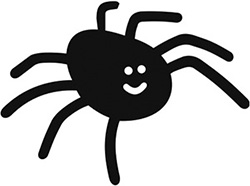

---
coverImage:
  image: developers.gif
  imageAlt: developers!
templateKey: blog-page
author: you2
date: 2022-04-19T18:52:29.530Z
image-alt: boom
title: test blog entry
tags:
  - potato
  - dog
  - one
image: img/developers.gif
description: whatever2
---
## Oh hi

blah blah blah testing

where does this image show?